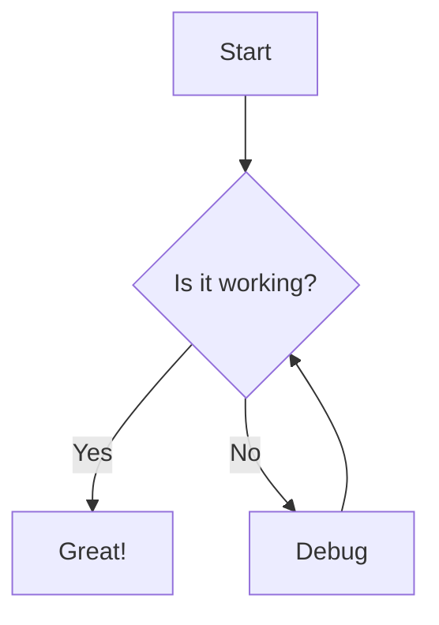
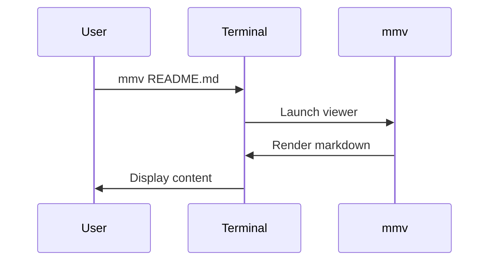
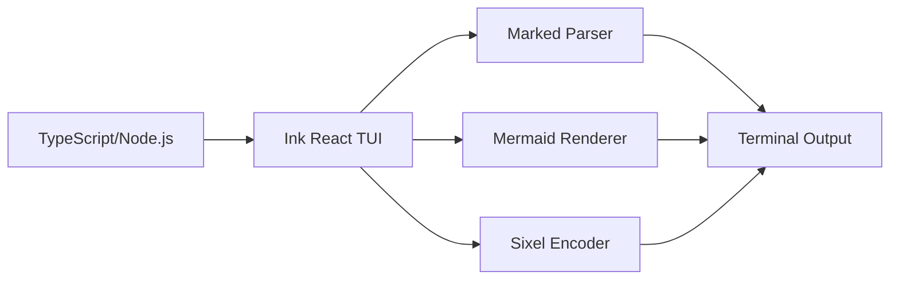

# mmm - Mixed Media Markdown

A modern terminal-based markdown viewer with sixel graphics support for inline images and diagrams.


## Quick Install

Copy and paste this into your terminal:

```bash
curl -fsSL https://raw.githubusercontent.com/aaronsb/markdown-mixed-media/main/install.js | node
```

Or using wget:

```bash
wget -qO- https://raw.githubusercontent.com/aaronsb/markdown-mixed-media/main/install.js | node
```

## Prerequisites

Before installing, you need:

1. **Node.js** (v18 or higher)
2. **Git** 
3. **Image rendering tool** (at least one):
   - `img2sixel` or `chafa` for sixel graphics

### Installing Image Tools

**Ubuntu/Debian:**
```bash
sudo apt install libsixel-bin chafa
```

**macOS:**
```bash
brew install libsixel chafa
```

**Arch Linux:**
```bash
sudo pacman -S libsixel chafa
```

## ✨ Features

- 📝 **Rich Markdown Rendering** - Full CommonMark support with styled output
- 🎨 **Syntax Highlighting** - Beautiful code blocks with theme support  
- 🖼️ **Inline Images** - Display images directly in terminal via Sixel/Kitty/iTerm protocols
- 📊 **Mermaid Diagrams** - Render flowcharts, sequence diagrams, and more
- 📦 **Single Entry** - One executable: mmm yourdocument.md

## 🚀 Quick Start

### Install from Source

```bash
# Clone the repository
git clone https://github.com/aaronsb/markdown-mixed-media.git
cd markdown-mixed-media

# Install dependencies
npm install

# Build the binary
npm run build:binary

# Install to ~/.local/bin
./scripts/install.sh

# View any markdown file
mmm README.md
```

### Prerequisites for Full Features

For image support:
```bash
# Ubuntu/Debian
sudo apt-get install libsixel-bin

# macOS
brew install libsixel

# Arch
yay -S libsixel
```

For Mermaid diagrams:
```bash
npm install -g @mermaid-js/mermaid-cli
```

## 📖 Usage

```bash
mmv [file] [options]

Options:
  --theme, -t  Color theme (dark, light, monokai)
  --help, -h   Show help
  --version    Show version

Examples:
  mmv README.md
  mmv docs/guide.md --theme monokai
  mmv  # Opens with welcome screen
```

## ⌨️ Keyboard Shortcuts

| Key | Action |
|-----|--------|
| `↑/↓` | Scroll up/down |
| `PgUp/PgDn` | Page up/down |
| `Home/End` | Jump to start/end |
| `Tab` | Navigate to next link |
| `Shift+Tab` | Navigate to previous link |
| `Enter` | Follow link |
| `Backspace` | Go back |
| `q` or `Esc` | Quit |

## 🎨 Supported Markdown Features

### Basic Formatting

**Bold text**, *italic text*, ~~strikethrough~~, `inline code`

### Lists

- Unordered list item 1
- Unordered list item 2
  - Nested item
  - Another nested item

1. Ordered list item 1
2. Ordered list item 2
   1. Nested ordered item
   2. Another nested

### Code Blocks

```javascript
// Syntax highlighted code
function greet(name) {
  console.log(`Hello, ${name}!`);
  return true;
}
```

```python
# Python example
def fibonacci(n):
    if n <= 1:
        return n
    return fibonacci(n-1) + fibonacci(n-2)
```

### Tables

| Feature | Support | Notes |
|---------|---------|-------|
| Images | ✅ | Sixel, Kitty, iTerm2 |
| Mermaid | ✅ | Via mermaid-cli |
| Links | ✅ | Internal & external |
| Tables | ✅ | With borders |

### Blockquotes

> "The best way to predict the future is to invent it."
> - Alan Kay

### Mermaid Diagrams





## 🏗️ Architecture



## 🛠️ Development

```bash
# Run in development mode
npm run dev

# Build TypeScript
npm run build

# Create standalone binary
npm run build:binary

# Run tests
npm test
```

### Project Structure

```
markdown-mixed-media/
├── src/
│   ├── index.tsx           # Main entry point
│   ├── components/         # React/Ink components
│   │   ├── MarkdownViewer.tsx
│   │   └── StatusBar.tsx
│   └── lib/               # Core libraries
│       ├── mermaid.ts     # Mermaid rendering
│       └── image.ts       # Image protocol handling
├── scripts/
│   ├── build-binary.js    # Binary builder
│   └── install.sh         # Installation script
├── package.json
├── tsconfig.json
└── README.md
```

## 🤝 Contributing

Contributions are welcome! Please feel free to submit a Pull Request.

1. Fork the repository
2. Create your feature branch (`git checkout -b feature/AmazingFeature`)
3. Commit your changes (`git commit -m 'Add some AmazingFeature'`)
4. Push to the branch (`git push origin feature/AmazingFeature`)
5. Open a Pull Request

## 📄 License

This project is licensed under the MIT License - see the [LICENSE](LICENSE) file for details.

## 🙏 Acknowledgments

- [Ink](https://github.com/vadimdemedes/ink) - React for CLIs
- [Marked](https://marked.js.org/) - Markdown parser
- [Mermaid](https://mermaid-js.github.io/) - Diagram and flowchart generation
- [libsixel](https://saitoha.github.io/libsixel/) - Sixel graphics encoder

## 🐛 Known Issues

- Sixel support requires compatible terminal emulator
- Large images may need resizing for optimal display
- Some terminals may not support all graphics protocols

## 🚦 Terminal Compatibility

| Terminal | Sixel | Kitty | iTerm2 |
|----------|-------|-------|--------|
| WezTerm | ✅ | ✅ | ✅ |
| Kitty | ✅ | ✅ | ❌ |
| iTerm2 | ✅ | ❌ | ✅ |
| Alacritty | ❌ | ❌ | ❌ |
| Windows Terminal | ✅* | ❌ | ❌ |
| GNOME Terminal | ❌ | ❌ | ❌ |
| Konsole | ✅ | ❌ | ❌ |

*Windows Terminal requires version 1.22+

---

Made with ❤️ for the terminal
