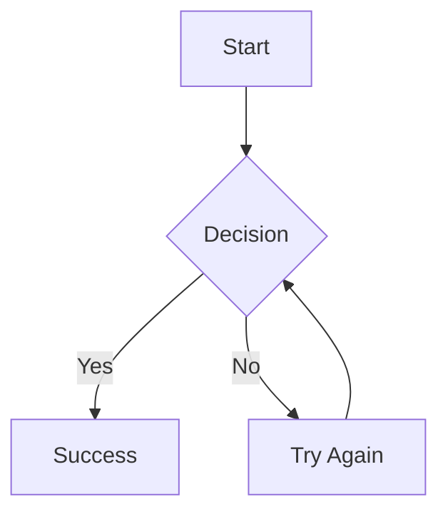

# MMM - Markdown Mixed Media

A powerful terminal-based markdown viewer and converter with inline image support, Mermaid diagrams, syntax highlighting, and export capabilities for PDF and ODT formats.


## ✨ Features

- 📝 **Rich Markdown Rendering** - Full CommonMark support with styled terminal output
- 🎨 **Advanced Syntax Highlighting** - Beautiful code blocks with semantic highlighting (bold keywords, italic functions, colored syntax)
- 🖼️ **Inline Images** - Display images directly in terminal using Sixel/iTerm2/Kitty protocols via chafa
- 📊 **Mermaid Diagrams** - Render flowcharts, sequence diagrams, and more (requires mermaid-cli)
- 📄 **PDF Export** - Generate professional PDFs with customizable fonts and layouts
- 📑 **ODT Export** - Create OpenDocument Text files for word processors
- ⚙️ **Interactive Settings** - Configure rendering profiles, fonts, colors, and more
- 🎯 **Standalone Binary** - Single executable that works independently after installation
- 🔍 **SVG Support** - Render embedded SVG graphics in documents

## 🚀 Quick Install

### From AUR (Arch Linux)

```bash
# Using yay
yay -S mmm

# Using paru
paru -S mmm

# Or build manually
git clone https://aur.archlinux.org/mmm.git
cd mmm
makepkg -si
```

For the development version:
```bash
yay -S mmm-git
```

### From Source

```bash
# Clone the repository
git clone https://github.com/aaronsb/markdown-mixed-media.git
cd markdown-mixed-media

# Install dependencies
npm install

# Build and install
./scripts/install.sh

# View any markdown file
mmm README.md
```

## 📋 Prerequisites

### Required
- **Node.js** v20 or higher (for building)
- **Git** (for cloning)

### Optional (but recommended)
- **chafa** - For image rendering in terminal
- **mermaid-cli** - For Mermaid diagram support

### Installing Dependencies

**Ubuntu/Debian:**
```bash
# Image support
sudo apt-get install chafa

# Mermaid diagrams
npm install -g @mermaid-js/mermaid-cli
# or
sudo apt-get install mermaid
```

**Arch Linux:**
```bash
# Image support
sudo pacman -S chafa

# Mermaid diagrams
yay -S mermaid-cli
# or
sudo pacman -S mermaid-cli
```

**macOS:**
```bash
# Image support
brew install chafa

# Mermaid diagrams
brew install mermaid-cli
# or
npm install -g @mermaid-js/mermaid-cli
```

**Fedora:**
```bash
# Image support
sudo dnf install chafa

# Mermaid diagrams
npm install -g @mermaid-js/mermaid-cli
```

## 📖 Usage

```bash
mmm [file] [options]
cat file.md | mmm               # Read from stdin

Options:
  --help, -h     Show help
  --version      Show version
  --check        Check dependencies and exit
  --settings     Configure MMM settings interactively
  --pdf          Generate PDF instead of terminal output
  --odt          Generate ODT instead of terminal output
  --profile      Specify render profile (default: terminal)

Examples:
  mmm README.md                    # View in terminal
  cat README.md | mmm              # Read from piped input
  echo "# Hello" | mmm             # Render markdown from echo
  mmm --pdf README.md              # Generate PDF (auto-named)
  mmm --pdf README.md output.pdf   # Generate PDF with custom name
  mmm --odt README.md              # Generate ODT document
  mmm --settings                   # Configure settings
  mmm --check                      # Check dependencies
```

## ⚙️ Configuration

MMM supports extensive configuration through the interactive settings menu:

```bash
mmm --settings
```

### Available Settings

#### Terminal Settings
- Terminal width fallback
- Image transparency threshold
- Table word wrapping
- Table width percentage

#### Image Settings
- Width percentage (10-100%)
- Alignment (left, center, right)
- DPI for PDF/ODT output

#### Mermaid Settings
- Diagram width and height
- Theme selection (dark, light, forest, neutral)
- Background color
- Font customization
- DPI for high-quality output

#### PDF Settings
- Page size (A4, Letter, Legal, A3)
- Orientation (portrait, landscape)
- Headers and footers
- Page numbers
- **Font selection** (NEW!)
  - Body font
  - Heading font
  - Code font
  - Interactive font browser with system font detection

#### ODT Settings
- Page configuration
- Export options

### Configuration File

Settings are stored in `~/.config/mmm/config.json` with multiple profiles:
- `terminal` - Default terminal viewing
- `pdf` - PDF export settings
- `odt` - ODT export settings
- `print` - Print-optimized settings

## 🎨 Supported Markdown Features

### Standard Markdown
- **Bold**, *italic*, ~~strikethrough~~, `inline code`
- Headers (H1-H6)
- Lists (ordered and unordered, nested)
- Blockquotes
- Horizontal rules
- Links and images
- Tables with borders

### Code Blocks with Syntax Highlighting

```javascript
// Enhanced syntax highlighting with:
// - Bold keywords (if, function, class)
// - Italic function calls
// - Colored strings, numbers, comments
function greet(name) {
  console.log(`Hello, ${name}!`);
  return true;
}
```

Supported languages:
- JavaScript/TypeScript
- Python
- Go
- Rust
- Java
- C/C++
- Ruby
- Bash/Shell
- SQL
- JSON
- YAML
- Markdown
- And many more...

### Mermaid Diagrams



### Embedded Images

Images are automatically rendered in the terminal using the best available protocol:
- Sixel graphics
- iTerm2 inline images
- Kitty graphics protocol

### SVG Graphics

Embedded SVG graphics are automatically rendered as images in terminal output.

## 🏗️ Architecture

MMM is built as a standalone application that:
1. Parses markdown using the `marked` library
2. Renders to terminal with custom formatting and image protocols
3. Exports to PDF using Puppeteer
4. Exports to ODT with proper formatting
5. Uses system `mermaid-cli` for diagram rendering

The application is compiled to a single executable that references the compiled JavaScript, making it portable and independent after installation.

## 📁 Project Structure

```
markdown-mixed-media/
├── src/
│   ├── index-direct.tsx      # Main terminal renderer
│   ├── index-simple.tsx      # Simple text renderer
│   ├── settings-cli.ts       # Interactive settings manager
│   ├── lib/
│   │   ├── config.ts         # Configuration management
│   │   ├── mermaid.ts        # Mermaid diagram rendering
│   │   ├── image.ts          # Image protocol handling
│   │   ├── svg.ts            # SVG rendering
│   │   ├── pdf-renderer.ts   # PDF generation
│   │   ├── odt-renderer.ts   # ODT generation
│   │   ├── font-utils.ts     # Font detection and selection
│   │   └── terminal-syntax-highlighter.ts  # Syntax highlighting
├── scripts/
│   ├── install.sh            # Installation script
│   ├── build-simple.js       # Simple build script
│   └── build-binary.js       # Binary builder
├── package.json
├── tsconfig.json
└── README.md
```

## 🛠️ Development

```bash
# Run in development mode
npm run dev

# Run simple text mode
npm run dev:simple

# Build TypeScript
npm run build

# Create executable
npm run build:simple

# Install locally
./scripts/install.sh

# Run tests
npm test
```

## 🚦 Terminal Compatibility

| Terminal | Image Support | Notes |
|----------|--------------|-------|
| WezTerm | ✅ | Full Sixel, iTerm2, Kitty support |
| Kitty | ✅ | Native graphics protocol |
| iTerm2 | ✅ | Native inline images |
| Konsole | ✅ | Sixel support |
| Windows Terminal | ✅* | Sixel in v1.22+ |
| Alacritty | ❌ | No image support |
| GNOME Terminal | ❌ | No image support |

## 🤝 Contributing

Contributions are welcome! Please feel free to submit a Pull Request.

1. Fork the repository
2. Create your feature branch (`git checkout -b feature/AmazingFeature`)
3. Commit your changes (`git commit -m 'Add some AmazingFeature'`)
4. Push to the branch (`git push origin feature/AmazingFeature`)
5. Open a Pull Request

## 📄 License

This project is licensed under the MIT License - see the [LICENSE](LICENSE) file for details.

## 🙏 Acknowledgments

- [Marked](https://marked.js.org/) - Markdown parser
- [Marked Terminal](https://github.com/mikaelbr/marked-terminal) - Terminal rendering
- [Mermaid](https://mermaid-js.github.io/) - Diagram generation
- [Chafa](https://hpjansson.org/chafa/) - Terminal graphics
- [Puppeteer](https://pptr.dev/) - PDF generation
- [Highlight.js](https://highlightjs.org/) - Syntax highlighting

## 🐛 Known Issues

- Mermaid diagrams require system-installed `mermaid-cli`
- Large images may need resizing for optimal display
- Some terminals may not support image protocols
- PDF generation requires Chromium/Chrome

---

Made with ❤️ for the terminal