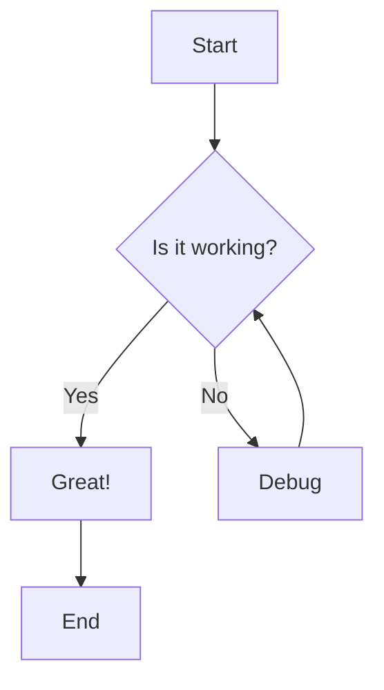
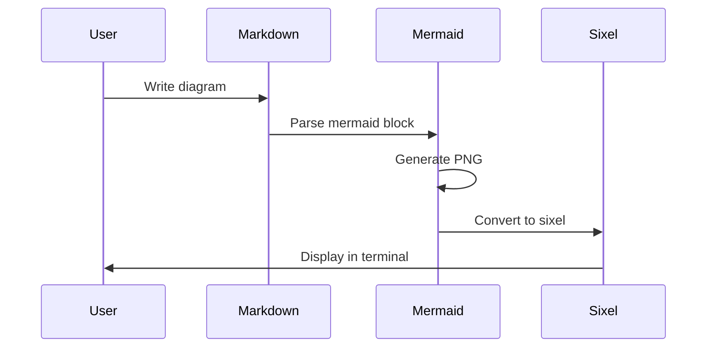
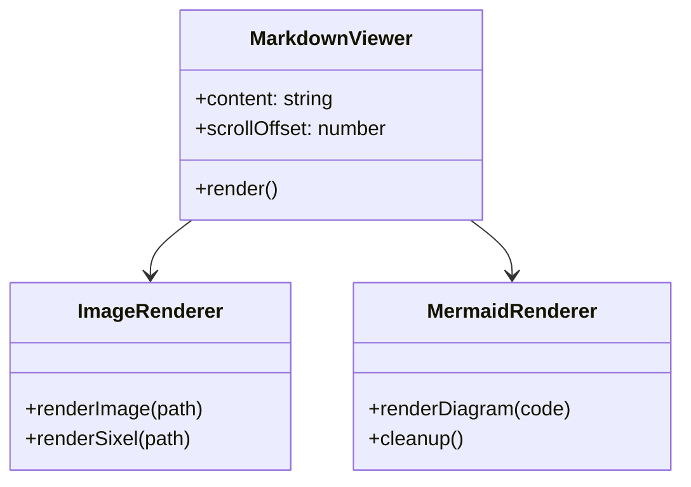

# Test Mermaid Rendering

This document tests the mermaid diagram rendering capability.

## Simple Flowchart



## Sequence Diagram



## Class Diagram



## Regular Code Block (not mermaid)

```javascript
// This should render as a normal code block
function hello() {
    console.log("Hello World!");
}
```

End of test document.