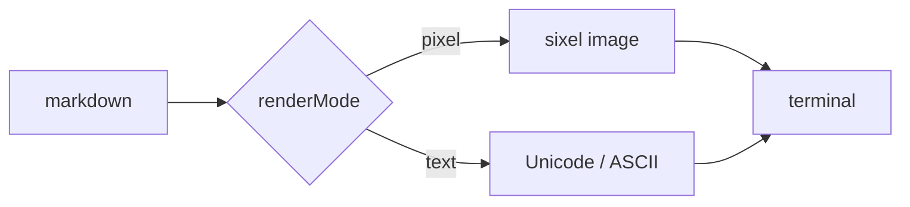
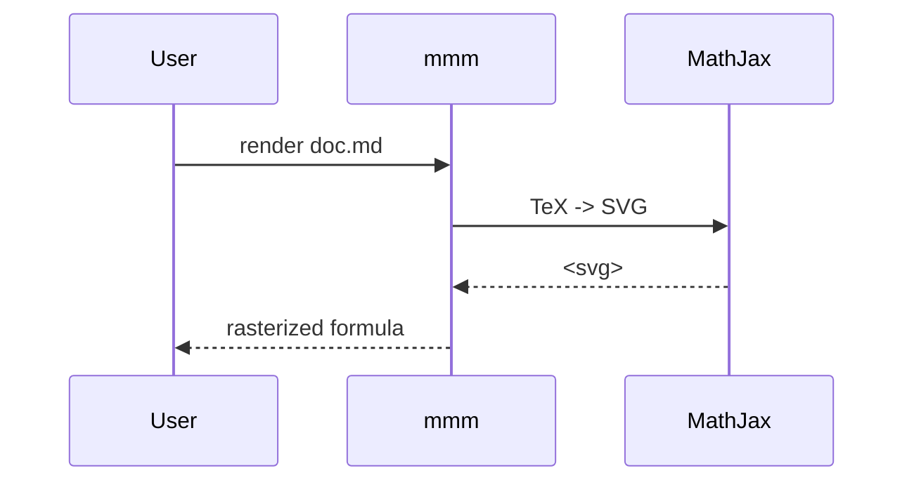
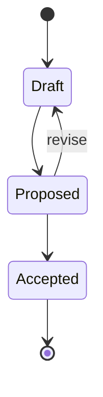

# Diagram rendering

A flowchart (rendered by beautiful-mermaid, no browser):

```mermaid
flowchart LR
    A[markdown] --> B{renderMode}
    B -->|pixel| C[sixel image]
    B -->|text| D[Unicode / ASCII]
    C --> E[terminal]
    D --> E
```

A sequence diagram:

```mermaid
sequenceDiagram
    participant U as User
    participant M as mmm
    participant J as MathJax
    U->>M: render doc.md
    M->>J: TeX -> SVG
    J-->>M: <svg>
    M-->>U: rasterized formula
```

A state diagram:

```mermaid
stateDiagram-v2
    [*] --> Draft
    Draft --> Proposed
    Proposed --> Accepted
    Accepted --> [*]
    Proposed --> Draft: revise
```
